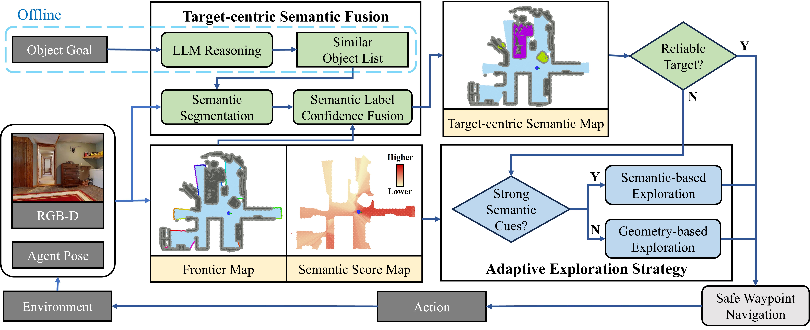
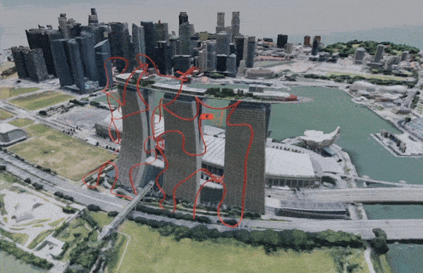

Hello! I'm Mingjie Zhang (张明杰), an MPhil student at [The Hong Kong University of Science and Technology (Guangzhou)](https://www.hkust-gz.edu.cn/), under the supervision of [Prof. Boyu ZHOU](https://sysu-star.com/) (周博宇) and [Prof. Jun MA](https://personal.hkust-gz.edu.cn/junma/people-page.html) (马骏).

My research interests lie in **Robotics** and **Embodied AI**, with a particular focus on:  
- Autonomous Aerial Reconstruction/Exploration  
- Vision-Language Navigation  

Education
======

- **MPhil**, The Hong Kong University of Science and Technology (Guangzhou), 
  *2024 – Present*  

- **B.Eng**, School of Electronics and Information, Northwestern Polytechnical University,
  *2020 – 2024*  

Experience
======

- **STAR Robotics Lab, Southern University of Science and Technology**
  - ***Research Assistant** Shenzhen, China*  *2023.07 – Present*
  - Worked on Vision-Language Navigation and Autonomous Aerial Exploration/Reconstruction in collaboration with **Prof. Boyu ZHOU**.

---

- **Northwestern Polytechnical University Football Robot Team**  
  - ***Captain of the Humanoid Robot Team** Xi'an, China*  *2022.07 – 2023.07*
  - Provided robot hardware/software technical support and achieved multiple national-level robotics awards.

Publications
======

(* stands for equal contribution, † stands for corresponding authors)

<html>
    <table style="width:100%;border:0px;border-spacing:0px;border-collapse:separate;margin-right:auto;margin-left:auto;">
        <tr onmouseout="nightsight_stop()" onmouseover="nightsight_start()">
            <td style="padding:10px;width:25%;vertical-align:middle;border-left-style:none;border-bottom-style:none;border-top-style:none;border-right-style:none">
              
            </td>
            <td style="padding:10px;width:75%;vertical-align:middle;border-left-style:none;border-bottom-style:none;border-top-style:none;border-right-style:none">
                <papertitle><strong>ApexNav: An Adaptive Exploration Strategy for Zero-Shot Object Navigation with Target-centric Semantic Fusion</strong>
                </papertitle>
                 
                <strong><u>Mingjie Zhang</u></strong>, Yuheng Du, Chengkai Wu, Jinni Zhou, Zhenchao Qi, Jun Ma, Boyu Zhou†
                 
                <em>IEEE Robotics and Automation Letters (RAL), 2025 (underview). </em> 
                
                
                
                
                 
            </td>
        </tr>
    </table>
    <table style="width:100%;border:0px;border-spacing:0px;border-collapse:separate;margin-right:auto;margin-left:auto;">
        <tr onmouseout="nightsight_stop()" onmouseover="nightsight_start()">
            <td style="padding:10px;width:25%;vertical-align:middle;border-left-style:none;border-bottom-style:none;border-top-style:none;border-right-style:none">
              
            </td>
            <td style="padding:10px;width:75%;vertical-align:middle;border-left-style:none;border-bottom-style:none;border-top-style:none;border-right-style:none">
                <papertitle><strong>SOAR: Simultaneous Exploration and Photographing with Heterogeneous UAVs for Fast Autonomous Reconstruction</strong>
                </papertitle>
                 
                <strong><u>Mingjie Zhang*</u></strong>, Chen Feng*, Zengzhi Li, Guiyong Zheng, Yiming Luo, Zhu Wang, Jinni Zhou, Shaojie Shen, and Boyu Zhou†
                 
                <em>IEEE/RSJ International Conference on Intelligent Robots and Systems (IROS), 2024. <strong>(Oral)</strong> </em> 
                
                
                
                
                
                 
            </td>
        </tr>
    </table>
    <table style="width:100%;border:0px;border-spacing:0px;border-collapse:separate;margin-right:auto;margin-left:auto;">
        <tr onmouseout="nightsight_stop()" onmouseover="nightsight_start()">
            <td style="padding:10px;width:25%;vertical-align:middle;border-left-style:none;border-bottom-style:none;border-top-style:none;border-right-style:none">
              
            </td>
            <td style="padding:10px;width:75%;vertical-align:middle;border-left-style:none;border-bottom-style:none;border-top-style:none;border-right-style:none">
                <papertitle><strong>FC-Planner: A Skeleton-guided Planning Framework for Fast Aerial Coverage of Complex 3D Scenes</strong>
                </papertitle>
                 
                Chen Feng, Haojia Li, <strong><u>Mingjie Zhang</u></strong>, Xinyi Chen, Boyu Zhou, and Shaojie Shen
                 
                <em>IEEE International Conference on Robotics and Automation (ICRA), 2024.<strong>(Best Paper Award on UAV Finalists)</strong></em> 
                
                
                
                
                
                 
            </td>
        </tr>
    </table>
    <table style="width:100%;border:0px;border-spacing:0px;border-collapse:separate;margin-right:auto;margin-left:auto;">
        <tr onmouseout="nightsight_stop()" onmouseover="nightsight_start()">
            <td style="padding:10px;width:25%;vertical-align:middle;border-left-style:none;border-bottom-style:none;border-top-style:none;border-right-style:none">
              
            </td>
            <td style="padding:10px;width:75%;vertical-align:middle;border-left-style:none;border-bottom-style:none;border-top-style:none;border-right-style:none">
                <papertitle><strong>Cooperative Aerial Robot Inspection Challenge: A Benchmark for Heterogeneous Multi-UAV Planning and Lessons Learned</strong>
                </papertitle>
                 
                Muqing Cao, Thien-Minh Nguyen, Shenghai Yuan, Andreas Anastasiou, Angelos Zacharia, Savvas Papaioannou, Panayiotis Kolios, Christos G Panayiotou, Marios M Polycarpou, Xinhang Xu, <strong><u>Mingjie Zhang</u></strong>, Fei Gao, Boyu Zhou, Ben M Chen, Lihua Xie
                 
                <em>IEEE Robotics Automation & Magazine (RAM), 2025. </em> 
                
                
                
                 
            </td>
        </tr>
    </table>
</html>

Selected Projects
======

### Design and Development of Titan: A Humanoid Combat Robot  
*July 2021 - July 2022*  
- Designed the mechanical structure and developed circuit boards for robot control, along with a corresponding remote control.  
- Developed control and communication APIs, and created a user-friendly PC-based motion editing visualization interface.  
- Awarded the **National-level Outstanding Achievement in Innovation and Entrepreneurship for College Students** and successfully **selected for the 16th National College Students' Innovation and Entrepreneurship Annual Conference**.  

    

---

### The System of Multi-sensor Fusion Based Teleoperation of Robotic Manipulator  
*September 2022 - May 2023*  
- Utilized an eye tracker and RealSense to locate the position of the gripping target and employed Kinect to obtain human arm posture information for grip solution derivation.  
- Utilized A* algorithm for path planning and polynomial interpolation for trajectory generation. Established a secure channel along the trajectory to facilitate manipulator control via force feedback during teleoperation.  
- Real-world experiments demonstrated a **36% accuracy improvement** over traditional teleoperation methods.  

    

---

### UAV Swarm Formation Transformation  
*July 2023 - November 2023*  
- Enhanced the localization accuracy of UAV swarms through the fusion of UWB, IMU, and vision technologies.  
- Utilized the Hungarian algorithm to optimize task allocation for drone formation transformation, minimizing energy consumption. Conducted real-world experimentation for validation.  

    
    

Selected Honors
======

* **IEEE ICRA Best Paper Award on UAV Finalists**, 2024, IEEE Robotics & Automation Society
* **National Scholarship**, 2022 & 2023, Ministry of Education of P.R. China
* **Outstanding Graduate**, 2024, Northwestern Polytechnical University
* **Outstanding Student**, 2021 & 2022 & 2023, Northwestern Polytechnical University
* **Cooperative Aerial Robots Inspection Challenge 3rd Place**, 2023, IEEE CDC
* **Yat-sen Challenge of Intelligent Cooperative Robots 1st Prize**, SYSU, 2023
* **National Robot Championship Competition First Prize**, 2021 & 2022, CAAI
* **International Underwater Robot Competition First Prize**, 2021, Organizing Committee of IURC

