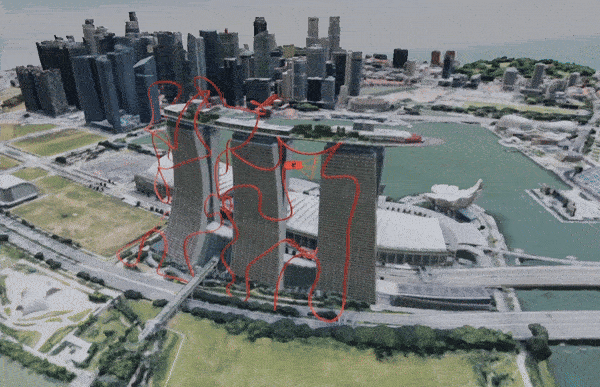
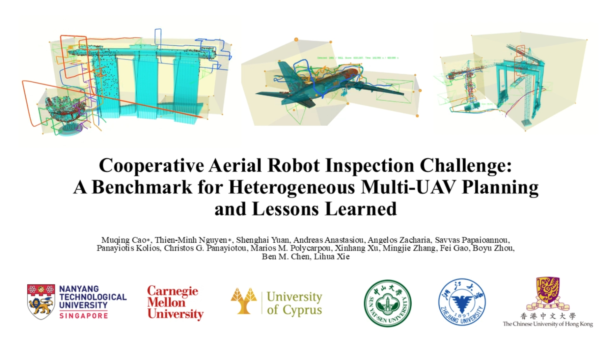

Hello! I'm Mingjie Zhang (张明杰), an MPhil student at [The Hong Kong University of Science and Technology (Guangzhou)](https://www.hkust-gz.edu.cn/), under the supervision of [Prof. Boyu ZHOU](https://robotics-star.com/people) (周博宇) and [Prof. Jun MA](https://personal.hkust-gz.edu.cn/junma/people-page.html) (马骏). I also work at [STAR Robotics Lab](https://robotics-star.com/people), Southern University of Science and Technology.

<!-- **I am actively looking for the PhD opportunity in Fall 2026.** -->

My research interests lie in **Robotics** and **Embodied AI**, related research and currently focusing on:  
- Vision-Language Navigation  
- Spatial Intelligence  
- Autonomous Robot Exploration/Reconstruction   

I also have a strong interest in Mobile Manipulation, VLA and Humanoid.

If you're interested in discussing research opportunities, collaborations, or related topics, feel free to reach out via email: [zagerzhang@gmail.com](mailto:zagerzhang@gmail.com).

**Hobbies**: Badminton🏸, Swimming🏊‍.

Publications
======

    <strong>*</strong> equal contribution
    <strong>†</strong> corresponding author

<html>
    <table class="publication-highlight" style="width:100%;border:0px;border-spacing:0px;border-collapse:separate;margin-right:auto;margin-left:auto;">
        <tr onmouseout="nightsight_stop()" onmouseover="nightsight_start()">
            <td style="padding:10px;width:25%;vertical-align:middle;border-left-style:none;border-bottom-style:none;border-top-style:none;border-right-style:none">
              
            </td>
            <td style="padding:10px;width:75%;vertical-align:middle;border-left-style:none;border-bottom-style:none;border-top-style:none;border-right-style:none">
                <papertitle><strong>C²-Explorer: Contiguity-Driven Task Allocation with Connectivity-Aware Task Representation for Decentralized Multi-UAV Exploration</strong>
                </papertitle>
                 
                Xinlu Yan*, <strong><u>Mingjie Zhang*</u></strong>, Yuhao Fang, Yanke Sun, Jun Ma, Youmin Gong, Boyu Zhou†, Jie Mei†
                 
                <em>arXiv Preprint, 2026. </em> 
                
                
                
                
                 
            </td>
        </tr>
    </table>
    <table class="publication-highlight" style="width:100%;border:0px;border-spacing:0px;border-collapse:separate;margin-right:auto;margin-left:auto;">
        <tr onmouseout="nightsight_stop()" onmouseover="nightsight_start()">
            <td style="padding:10px;width:25%;vertical-align:middle;border-left-style:none;border-bottom-style:none;border-top-style:none;border-right-style:none">
              
            </td>
            <td style="padding:10px;width:75%;vertical-align:middle;border-left-style:none;border-bottom-style:none;border-top-style:none;border-right-style:none">
                <papertitle><strong>OnFly: Onboard Zero-Shot Aerial Vision-Language Navigation toward Safety and Efficiency</strong>
                </papertitle>
                 
                Guiyong Zheng, Yueting Ban, <strong><u>Mingjie Zhang</u></strong>, Juepeng Zheng, Boyu Zhou†
                 
                <em>arXiv Preprint, 2026. </em> 
                
                
                
                
                 
            </td>
        </tr>
    </table>
    <table style="width:100%;border:0px;border-spacing:0px;border-collapse:separate;margin-right:auto;margin-left:auto;">
        <tr onmouseout="nightsight_stop()" onmouseover="nightsight_start()">
            <td style="padding:10px;width:25%;vertical-align:middle;border-left-style:none;border-bottom-style:none;border-top-style:none;border-right-style:none">
              
            </td>
            <td style="padding:10px;width:75%;vertical-align:middle;border-left-style:none;border-bottom-style:none;border-top-style:none;border-right-style:none">
                <papertitle><strong>ApexNav: An Adaptive Exploration Strategy for Zero-Shot Object Navigation with Target-centric Semantic Fusion</strong>
                </papertitle>
                 
                <strong><u>Mingjie Zhang</u></strong>, Yuheng Du, Chengkai Wu, Jinni Zhou, Zhenchao Qi, Jun Ma, Boyu Zhou†
                 
                <em>IEEE Robotics and Automation Letters (RAL), 2025. </em> 
                
                
                
                
                
                 
            </td>
        </tr>
    </table>
    <table class="publication-highlight" style="width:100%;border:0px;border-spacing:0px;border-collapse:separate;margin-right:auto;margin-left:auto;">
        <tr onmouseout="nightsight_stop()" onmouseover="nightsight_start()">
            <td style="padding:10px;width:25%;vertical-align:middle;border-left-style:none;border-bottom-style:none;border-top-style:none;border-right-style:none">
              
            </td>
            <td style="padding:10px;width:75%;vertical-align:middle;border-left-style:none;border-bottom-style:none;border-top-style:none;border-right-style:none">
                <papertitle><strong>SOAR: Simultaneous Exploration and Photographing with Heterogeneous UAVs for Fast Autonomous Reconstruction</strong>
                </papertitle>
                 
                <strong><u>Mingjie Zhang*</u></strong>, Chen Feng*, Zengzhi Li, Guiyong Zheng, Yiming Luo, Zhu Wang, Jinni Zhou, Shaojie Shen, and Boyu Zhou†
                 
                <em>IEEE/RSJ International Conference on Intelligent Robots and Systems (IROS), 2024. <strong>(Oral)</strong> </em> 
                
                
                
                
                
                
                 
            </td>
        </tr>
    </table>
    <table style="width:100%;border:0px;border-spacing:0px;border-collapse:separate;margin-right:auto;margin-left:auto;">
        <tr onmouseout="nightsight_stop()" onmouseover="nightsight_start()">
            <td style="padding:10px;width:25%;vertical-align:middle;border-left-style:none;border-bottom-style:none;border-top-style:none;border-right-style:none">
              
            </td>
            <td style="padding:10px;width:75%;vertical-align:middle;border-left-style:none;border-bottom-style:none;border-top-style:none;border-right-style:none">
                <papertitle><strong>FC-Planner: A Skeleton-guided Planning Framework for Fast Aerial Coverage of Complex 3D Scenes</strong>
                </papertitle>
                 
                Chen Feng, Haojia Li, <strong><u>Mingjie Zhang</u></strong>, Xinyi Chen, Boyu Zhou†, and Shaojie Shen
                 
                <em>IEEE International Conference on Robotics and Automation (ICRA), 2024. 
                 
                <strong>(Best Paper Award on UAV Finalists)</strong></em> 
                
                
                
                
                
                
                 
            </td>
        </tr>
    </table>
    <table style="width:100%;border:0px;border-spacing:0px;border-collapse:separate;margin-right:auto;margin-left:auto;">
        <tr onmouseout="nightsight_stop()" onmouseover="nightsight_start()">
            <td style="padding:10px;width:25%;vertical-align:middle;border-left-style:none;border-bottom-style:none;border-top-style:none;border-right-style:none">
              
            </td>
            <td style="padding:10px;width:75%;vertical-align:middle;border-left-style:none;border-bottom-style:none;border-top-style:none;border-right-style:none">
                <papertitle><strong>Cooperative Aerial Robot Inspection Challenge: A Benchmark for Heterogeneous Multi-UAV Planning and Lessons Learned</strong>
                </papertitle>
                 
                Muqing Cao, Thien-Minh Nguyen, Shenghai Yuan, Andreas Anastasiou, Angelos Zacharia, Savvas Papaioannou, Panayiotis Kolios, Christos G Panayiotou, Marios M Polycarpou, Xinhang Xu, <strong><u>Mingjie Zhang</u></strong>, Fei Gao, Boyu Zhou, Ben M Chen, Lihua Xie
                 
                <em>IEEE Robotics Automation & Magazine (RAM), 2025. </em> 
                
                
                
                
                 
            </td>
        </tr>
    </table>
</html>

Selected Honors
======

<ul class="selected-honors">
    <li class="honor-featured">
        IEEE ICRA Best Paper Award on UAV Finalists
        2024 | IEEE Robotics & Automation Society
    </li>
    <li class="honor-featured">
        National Scholarship
        2022 & 2023 | Ministry of Education of P.R. China
    </li>
    <li>
        Outstanding Graduate
        2024 | Northwestern Polytechnical University
    </li>
    <li>
        Outstanding Student
        2021, 2022 & 2023 | Northwestern Polytechnical University
    </li>
    <li>
        Cooperative Aerial Robots Inspection Challenge 3rd Place
        2023 | IEEE Conference on Decision and Control (CDC)
    </li>
    <li>
        Yat-sen Challenge of Intelligent Cooperative Robots 1st Prize
        2023 | Sun Yat-sen University
    </li>
    <li>
        National Robot Championship Competition First Prize
        2021 & 2022 | CAAI
    </li>
    <li>
        International Underwater Robot Competition First Prize
        2021 | Organizing Committee of IURC
    </li>
</ul>