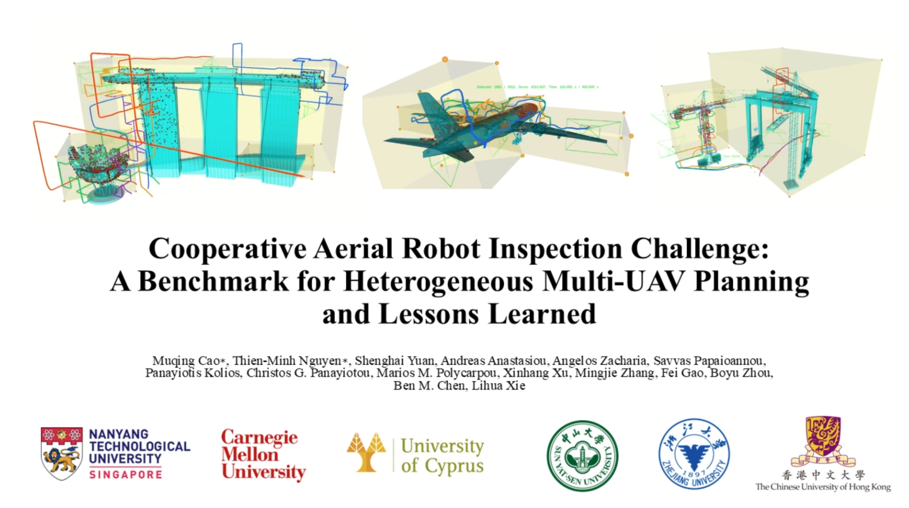

Hello! I'm Mingjie Zhang (张明杰), an MPhil student at [The Hong Kong University of Science and Technology (Guangzhou)](https://www.hkust-gz.edu.cn/), under the supervision of [Prof. Boyu ZHOU](https://robotics-star.com/people) (周博宇) and [Prof. Jun MA](https://personal.hkust-gz.edu.cn/junma/people-page.html) (马骏).

**I am actively looking for the PhD opportunity in Fall 2026.**

My research interests lie in **Robotics** and **Embodied AI**, related research and currently focusing on:  
- Vision-Language Navigation  
- Autonomous Robot Exploration/Reconstruction   

I also have a strong interest in Mobile Manipulation, VLA and Humanoid.

**Hobbies**: Badminton🏸, Swimming🏊‍.

Education
======

- **MPhil**, The Hong Kong University of Science and Technology (Guangzhou), 
  *2024 – 2026 (expected)*

- **B.Eng**, School of Electronics and Information, Northwestern Polytechnical University,
  *2020 – 2024*  

Experience
======

- **[STAR Robotics Lab](https://robotics-star.com/people) , Southern University of Science and Technology**
  - ***Research Assistant** Shenzhen, China*  *2023.08 – Present*
  - Worked on Vision-Language Navigation and Autonomous Aerial Exploration/Reconstruction in collaboration with **Prof. Boyu ZHOU**.

---

- **Football Robot Team, Northwestern Polytechnical University**  
  - ***Captain of the Humanoid Robot Team** Xi'an, China*  *2022.07 – 2023.08*
  - Provided robot hardware/software technical support and achieved multiple national-level robotics awards.

Publications
======

<html>
    (* stands for equal contribution, † stands for corresponding authors)
    <table style="width:100%;border:0px;border-spacing:0px;border-collapse:separate;margin-right:auto;margin-left:auto;">
        <tr onmouseout="nightsight_stop()" onmouseover="nightsight_start()">
            <td style="padding:10px;width:25%;vertical-align:middle;border-left-style:none;border-bottom-style:none;border-top-style:none;border-right-style:none">
              
            </td>
            <td style="padding:10px;width:75%;vertical-align:middle;border-left-style:none;border-bottom-style:none;border-top-style:none;border-right-style:none">
                <papertitle><strong>ApexNav: An Adaptive Exploration Strategy for Zero-Shot Object Navigation with Target-centric Semantic Fusion</strong>
                </papertitle>
                 
                <strong><u>Mingjie Zhang</u></strong>, Yuheng Du, Chengkai Wu, Jinni Zhou, Zhenchao Qi, Jun Ma, Boyu Zhou†
                 
                <em>IEEE Robotics and Automation Letters (RAL), 2025 (underview). </em> 
                
                
                
                
                 
            </td>
        </tr>
    </table>
    <table style="width:100%;border:0px;border-spacing:0px;border-collapse:separate;margin-right:auto;margin-left:auto;">
        <tr onmouseout="nightsight_stop()" onmouseover="nightsight_start()">
            <td style="padding:10px;width:25%;vertical-align:middle;border-left-style:none;border-bottom-style:none;border-top-style:none;border-right-style:none">
              
            </td>
            <td style="padding:10px;width:75%;vertical-align:middle;border-left-style:none;border-bottom-style:none;border-top-style:none;border-right-style:none">
                <papertitle><strong>SOAR: Simultaneous Exploration and Photographing with Heterogeneous UAVs for Fast Autonomous Reconstruction</strong>
                </papertitle>
                 
                <strong><u>Mingjie Zhang*</u></strong>, Chen Feng*, Zengzhi Li, Guiyong Zheng, Yiming Luo, Zhu Wang, Jinni Zhou, Shaojie Shen, and Boyu Zhou†
                 
                <em>IEEE/RSJ International Conference on Intelligent Robots and Systems (IROS), 2024. <strong>(Oral)</strong> </em> 
                
                
                
                
                
                 
            </td>
        </tr>
    </table>
    <table style="width:100%;border:0px;border-spacing:0px;border-collapse:separate;margin-right:auto;margin-left:auto;">
        <tr onmouseout="nightsight_stop()" onmouseover="nightsight_start()">
            <td style="padding:10px;width:25%;vertical-align:middle;border-left-style:none;border-bottom-style:none;border-top-style:none;border-right-style:none">
              
            </td>
            <td style="padding:10px;width:75%;vertical-align:middle;border-left-style:none;border-bottom-style:none;border-top-style:none;border-right-style:none">
                <papertitle><strong>FC-Planner: A Skeleton-guided Planning Framework for Fast Aerial Coverage of Complex 3D Scenes</strong>
                </papertitle>
                 
                Chen Feng, Haojia Li, <strong><u>Mingjie Zhang</u></strong>, Xinyi Chen, Boyu Zhou†, and Shaojie Shen
                 
                <em>IEEE International Conference on Robotics and Automation (ICRA), 2024. 
                 
                <strong>(Best Paper Award on UAV Finalists)</strong></em> 
                
                
                
                
                
                 
            </td>
        </tr>
    </table>
    <table style="width:100%;border:0px;border-spacing:0px;border-collapse:separate;margin-right:auto;margin-left:auto;">
        <tr onmouseout="nightsight_stop()" onmouseover="nightsight_start()">
            <td style="padding:10px;width:25%;vertical-align:middle;border-left-style:none;border-bottom-style:none;border-top-style:none;border-right-style:none">
              
            </td>
            <td style="padding:10px;width:75%;vertical-align:middle;border-left-style:none;border-bottom-style:none;border-top-style:none;border-right-style:none">
                <papertitle><strong>Cooperative Aerial Robot Inspection Challenge: A Benchmark for Heterogeneous Multi-UAV Planning and Lessons Learned</strong>
                </papertitle>
                 
                Muqing Cao, Thien-Minh Nguyen, Shenghai Yuan, Andreas Anastasiou, Angelos Zacharia, Savvas Papaioannou, Panayiotis Kolios, Christos G Panayiotou, Marios M Polycarpou, Xinhang Xu, <strong><u>Mingjie Zhang</u></strong>, Fei Gao, Boyu Zhou, Ben M Chen, Lihua Xie
                 
                <em>IEEE Robotics Automation & Magazine (RAM), 2025. </em> 
                
                
                
                 
            </td>
        </tr>
    </table>
</html>

Selected Honors
======

* **IEEE ICRA Best Paper Award on UAV Finalists**, 2024, IEEE Robotics & Automation Society
* **National Scholarship**, 2022 & 2023, Ministry of Education of P.R. China
* **Outstanding Graduate**, 2024, Northwestern Polytechnical University
* **Outstanding Student**, 2021 & 2022 & 2023, Northwestern Polytechnical University
* **Cooperative Aerial Robots Inspection Challenge 3rd Place**, 2023, IEEE CDC
* **Yat-sen Challenge of Intelligent Cooperative Robots 1st Prize**, 2023, SYSU
* **National Robot Championship Competition First Prize**, 2021 & 2022, CAAI
* **International Underwater Robot Competition First Prize**, 2021, Organizing Committee of IURC