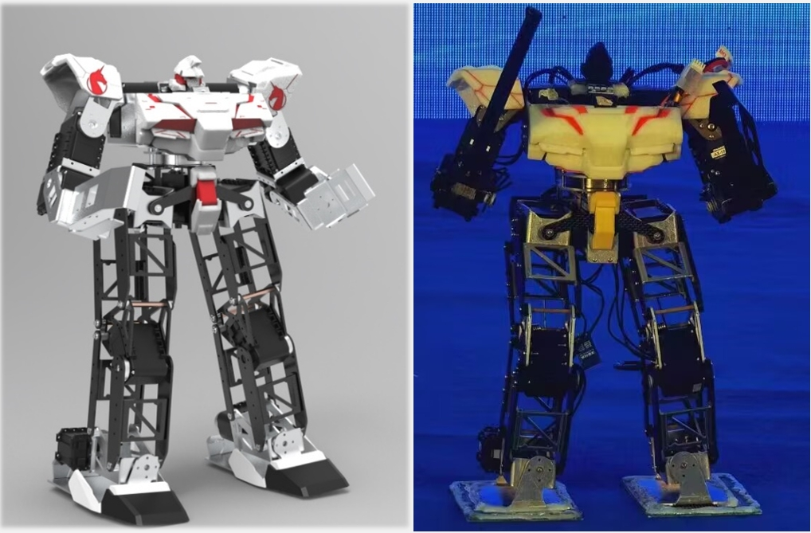

## Design and Development of Titan: A Humanoid Combat Robot  
*July 2021 - July 2022*  
- Designed the mechanical structure and developed circuit boards for robot control, along with a corresponding remote control.  
- Developed control and communication APIs, and created a user-friendly PC-based motion editing visualization interface.  
- Awarded the **National-level Outstanding Achievement in Innovation and Entrepreneurship for College Students** and successfully **selected for the 16th National College Students' Innovation and Entrepreneurship Annual Conference**.  

    

## The System of Multi-sensor Fusion Based Teleoperation of Robotic Manipulator  
*September 2022 - May 2023*  
- Utilized an eye tracker and RealSense to locate the position of the gripping target and employed Kinect to obtain human arm posture information for grip solution derivation.  
- Utilized A* algorithm for path planning and polynomial interpolation for trajectory generation. Established a secure channel along the trajectory to facilitate manipulator control via force feedback during teleoperation.  
- Real-world experiments demonstrated a **36% accuracy improvement** over traditional teleoperation methods.  

    

## UAV Swarm Formation Transformation  
*July 2023 - November 2023*  
- Enhanced the localization accuracy of UAV swarms through the fusion of UWB, IMU, and vision technologies.  
- Utilized the Hungarian algorithm to optimize task allocation for drone formation transformation, minimizing energy consumption. Conducted real-world experimentation for validation.  

    
    

## Autonomous UAV Exploration of Unknown Mine Environments
*March 2024 - August 2024*
- Developed a robust autonomous UAV system capable of exploring large-scale underground mine environments (over 1 million $m^3$) under communication-denied conditions.
-  Integrated frontier-based exploration with a K-TSP-based viewpoint planner to enable efficient and lightweight exploration; applied kinodynamic A* with B-spline smoothing for safe and smooth trajectory generation.

    

